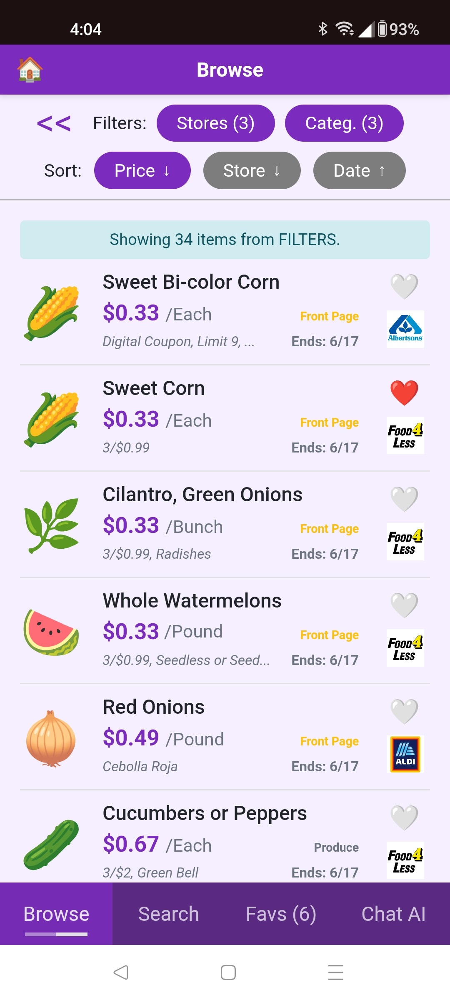

# Grocery-Buddy 🛒

**Your smart companion for tracking grocery deals and managing your shopping budget.**

## Overview

Grocery-Buddy is a full-stack web application designed to help users discover the best grocery deals from various retailers. Users can browse promotions, filter by store or category, save their favorite items, and get an overview of when deals expire. The goal is to make grocery shopping more efficient and budget-friendly.

## Key Features

- **--Frontend--**

  - **Browse Deals:** View a comprehensive list of current grocery promotions.
    - Filter by retailers/categories; sort by price, etc.
  - **Search:** Search for specific products across all retailers.
  - **Favorites:** Save your favorite deals for quick access.
  - **CHAT with AI:** Vector embeddings enable semantic similarity search

- **--Backend--**

  - **PDF Processing:** Extraction of deal information from uploaded PDF flyers.
    - Google Gemini AI extracts PDF content into structured JSON format
    - JSON extraction undergoes enhancement processing for improved data quality, then stored in Supabase (PostgreSQL) database
  - **AI-Powered Search:** Vector embeddings enable semantic similarity search
    - Batch embedding generation for all products
    - Intelligent product matching and recommendations
  - **RESTful API:** Comprehensive endpoints for data retrieval and management
    - Product search and filtering endpoints
    - Retailer management
    - Background task processing for CPU-intensive operations

- **--AI Features--**

  - **Chat With AI:** Ask it to curate a shopping list.
    - EG. "Put together a high-protein shopping list for $75."
    - Or, "Assemble a balanced meal plan with emphasis on produce for a family of 3 for $150."

## Tech Stack 🛠️

This project leverages a modern, AI-enhanced tech stack:

- **Frontend:**
  - **React:**
  - **TypeScript:**
  - **Vite:**
- **Backend:**
  - **Python:**
  - **FastAPI:**
  - **SQLAlchemy:**
  - **Pydantic:**
  - **Large Language Models (LLMs):**
- **Database & BaaS:**
  - **Supabase (PostgreSQL):**
- **Version Control:**
  - **Git & GitHub:**

## Project Structure 📁

```
grocery-budget-assistant/
├── backend/                 # FastAPI backend application
│   ├── app/                # Core application logic
│   │   ├── routers/        # API route definitions
│   │   ├── services/       # Business logic services
│   │   ├── schemas/        # Pydantic data models
│   │   └── utils/          # Utility functions
│   └── pdf/                # PDF processing directories
├── frontend/               # React frontend application
│   ├── src/
│   │   ├── components/     # Reusable UI components
│   │   ├── views/          # Page-level components
│   │   ├── hooks/          # Custom React hooks
│   │   └── styles/         # CSS files and themes
└── docs/                   # Project documentation
```

**Backend Structure:**


## Screenshots 📸

<!-- **Main Deal Browse Interface:** -->


<!-- **Favorites Management View:** -->


<!-- **Filtering Options (Example):** -->


<!-- **Dark Mode Theme:** -->


<!-- **Mobile/Responsive View (Example):** -->


## Documentation 📚

- **[ProjectDoc.md](./docs/ProjectDoc.md)** - Comprehensive technical documentation
- **[ProjectFiles.md](./docs/ProjectFiles.md)** - Detailed file structure and descriptions
