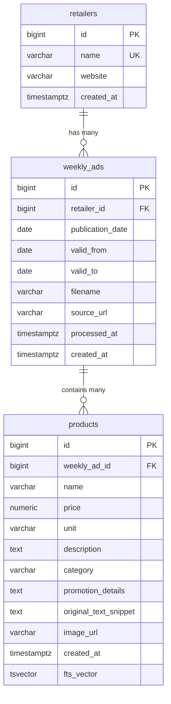
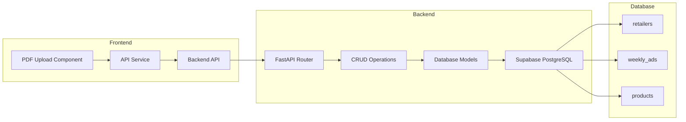

# Project Structure

## Directory Structure

graph TD
A[grocery-budget-assistant] --> B[backend]
A --> C[frontend]
A --> D[docs]

    B --> E[app]
    B --> F[sql]

    E --> G[main.py]
    E --> H[models.py]
    E --> I[crud.py]
    E --> J[database.py]
    E --> K[uploads/]

    F --> L[schema.sql]

    C --> M[src]
    C --> N[public]

    M --> P[components]
    M --> Q[services]
    M --> R[App.tsx]
    M --> S[main.tsx]

    P --> T[pdf-upload]

## Database Schema

## Component Flow

## Key Features

- PDF Upload and Processing
- Weekly Ad Management
- Product Tracking
- Full-text Search
- RESTful API Integration

## Technology Stack

- Frontend: React + TypeScript + Vite
- Backend: FastAPI + SQLAlchemy
- Database: PostgreSQL (Supabase)
- Testing: Cypress
- Development Tools: uvicorn, python-dotenv
