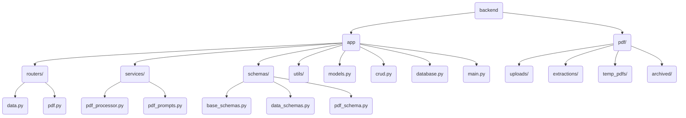

# Project Structure & Flow

## Directory Structure

graph TD
A[grocery-budget-assistant] --> B[backend]
A --> C[frontend]
A --> D[docs]

    B --> E[app]
    B --> F[sql]
    B --> PDFDIR[pdf/]

    E --> G[main.py]
    E --> H[models.py]
    E --> I[crud.py]
    E --> J[database.py]
    E --> UTILS[utils/]

    F --> L[schema.sql]

    PDFDIR --> K[uploads/]
    PDFDIR --> EXT[extractions/]
    PDFDIR --> TMP[temp_pdfs/]
    PDFDIR --> ARC[archived/]

    C --> M[src]
    C --> N[public]

    M --> P[components]
    M --> Q[services]
    M --> R[App.tsx]
    M --> S[main.tsx]

    P --> T[pdf-upload]

## Backend Directory Structure (Simplified)



## Database Schema


## Component Flow


## Key Features

- PDF Upload and Processing
- Weekly Ad Management
- Product Tracking
- Full-text Search
- RESTful API Integration

## PDF Processing Flow

```mermaid
sequenceDiagram
    participant Client
    participant PDFRouter as FastAPI Router (/pdf)
    participant BackgroundTask
    participant PDFProcessor as PDF Processor Service
    participant GeminiAPI as Google Gemini API
    participant UploadsDir as Directory (uploads/)
    participant ExtractionsDir as Directory (extractions/)

    Client->>+PDFRouter: POST /process-uploads
    PDFRouter->>UploadsDir: Scan for *.pdf files
    UploadsDir-->>PDFRouter: List of PDF paths
    loop For Each PDF Path
        PDFRouter->>BackgroundTask: Add Task (run_processor_for_file(pdf_path))
    end
    PDFRouter-->>-Client: 202 Accepted (Queued)

    BackgroundTask->>+PDFProcessor: process_pdf_to_json(pdf_path)
    PDFProcessor->>UploadsDir: Read PDF file
    UploadsDir-->>PDFProcessor: PDF data
    PDFProcessor->>+GeminiAPI: Upload File (PDF)
    GeminiAPI-->>-PDFProcessor: Uploaded File Handle
    PDFProcessor->>+GeminiAPI: Generate Content (Prompt + File Handle)
    GeminiAPI-->>-PDFProcessor: JSON Response (string)
    PDFProcessor->>PDFProcessor: Validate JSON (using pdf_schema)
    alt Validation OK
        PDFProcessor->>ExtractionsDir: Write Validated JSON data
        ExtractionsDir-->>PDFProcessor: Success
        PDFProcessor-->>-BackgroundTask: Return JSON path
    else Validation Fails
        PDFProcessor-->>-BackgroundTask: Return None (Error logged)
    end
```

## JSON to Database Flow


## Data API Flow (Example: Product Upsert)


## Technology Stack

- Frontend: React + TypeScript + Vite
- Backend: FastAPI + SQLAlchemy + google-generativeai + aiofiles
- Database: PostgreSQL (Supabase)
- Testing: Cypress
- Development Tools: uvicorn, python-dotenv
