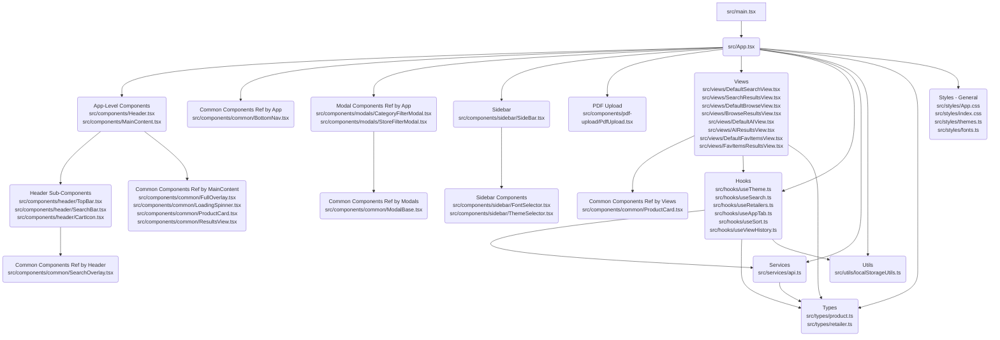
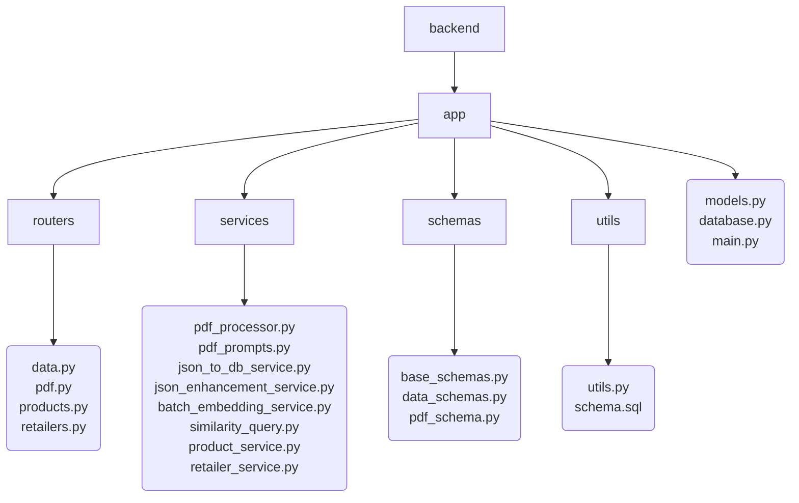
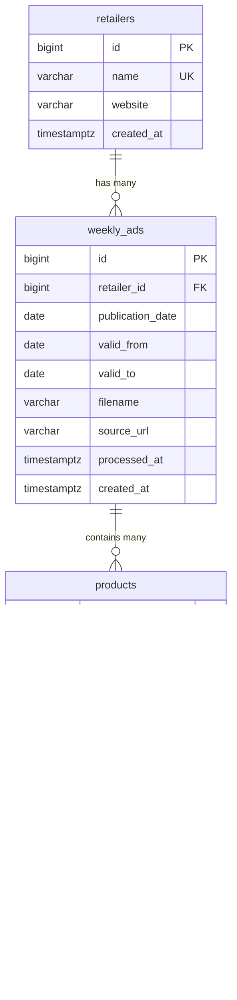
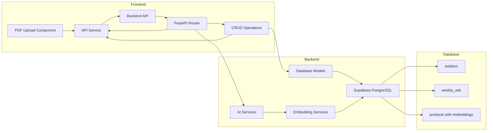
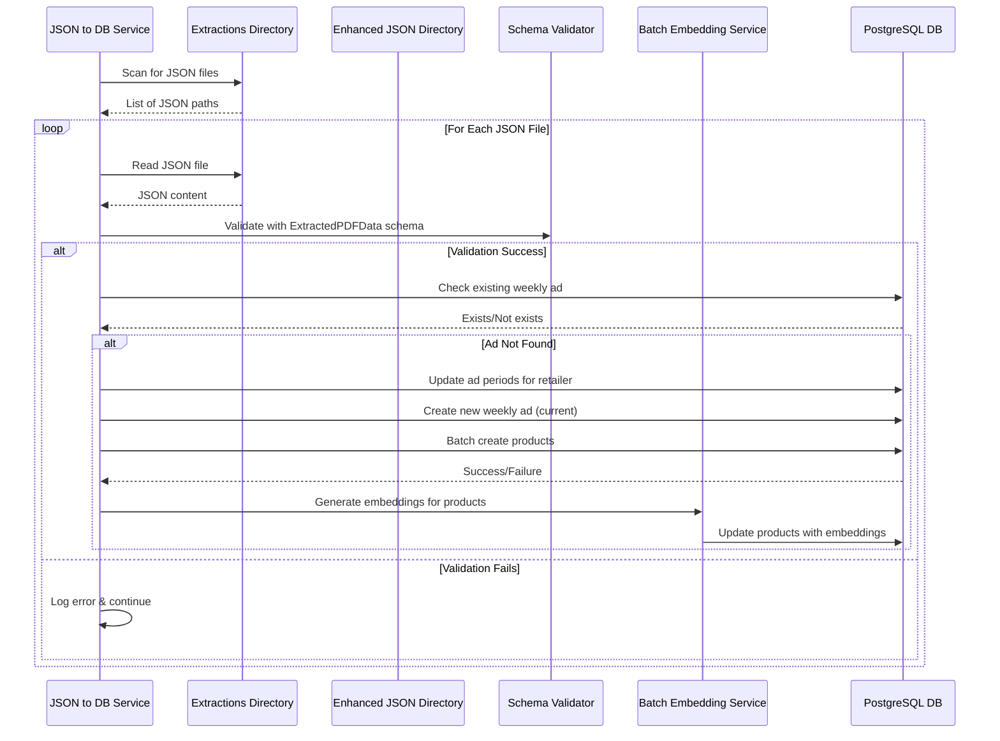
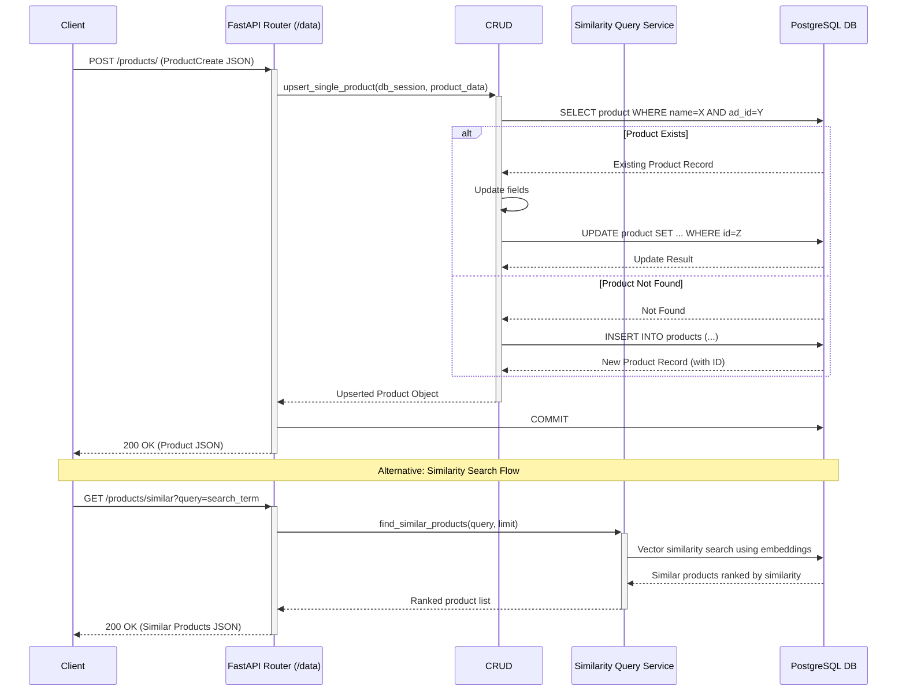

# Project Structure & Flow

<!-- (when updating, keep to this format consistency, ignore init files) -->

## Frontend Directory Structure (Detailed)

```mermaid
graph TD
    MainTSX[src/main.tsx] --> AppTSX(src/App.tsx)

    subgraph AppLevel [App.tsx Imports & Structure]
        AppTSX --> Header(src/components/Header.tsx)
        AppTSX --> MainContent(src/components/MainContent.tsx)
        AppTSX --> CommonBottomNav(src/components/common/BottomNav.tsx)
        AppTSX --> SideBar(src/components/sidebar/SideBar.tsx)
        AppTSX --> PdfUpload(src/components/pdf-upload/PdfUpload.tsx)
        AppTSX --> CategoryFilterModal(src/components/modals/CategoryFilterModal.tsx)
        AppTSX --> StoreFilterModal(src/components/modals/StoreFilterModal.tsx)
        AppTSX --> DefaultSearchView(src/views/DefaultSearchView.tsx)
        AppTSX --> SearchResultsView(src/views/SearchResultsView.tsx)
        AppTSX --> DefaultBrowseView(src/views/DefaultBrowseView.tsx)
        AppTSX --> BrowseResultsView(src/views/BrowseResultsView.tsx)
        AppTSX --> DefaultAIView(src/views/DefaultAIView.tsx)
        AppTSX --> AIResultsView(src/views/AIResultsView.tsx)
        AppTSX --> DefaultFavItemsView(src/views/DefaultFavItemsView.tsx)
        AppTSX --> FavItemsResultsView(src/views/FavItemsResultsView.tsx)
        AppTSX --> useThemeHook(src/hooks/useTheme.ts)
        AppTSX --> useSearchHook(src/hooks/useSearch.ts)
        AppTSX --> useRetailersHook(src/hooks/useRetailers.ts)
        AppTSX --> useAppTabHook(src/hooks/useAppTab.ts)
        AppTSX --> useSortHook(src/hooks/useSort.ts)
        AppTSX --> useViewHistoryHook(src/hooks/useViewHistory.ts)
        AppTSX --> apiService(src/services/api.ts)
        AppTSX --> localStorageUtils(src/utils/localStorageUtils.ts)
    end

    subgraph MainContentLevel [MainContent.tsx Imports]
        MainContent --> CommonFullOverlay(src/components/common/FullOverlay.tsx)
        MainContent --> CommonLoadingSpinner(src/components/common/LoadingSpinner.tsx)
        MainContent --> CommonProductCard(src/components/common/ProductCard.tsx)
        MainContent --> CommonResultsView(src/components/common/ResultsView.tsx)
    end

    subgraph HeaderLevel [Header.tsx and components/header/*]
       Header(src/components/Header.tsx) --> TopBar(src/components/header/TopBar.tsx)
       Header --> SearchBar(src/components/header/SearchBar.tsx)
       Header --> CartIcon(src/components/header/CartIcon.tsx)
       SearchBar --> CommonSearchOverlay(src/components/common/SearchOverlay.tsx)
    end

    subgraph SideBarLevel [SideBar.tsx Imports]
        SideBar(src/components/sidebar/SideBar.tsx) --> FontSelector(src/components/sidebar/FontSelector.tsx)
        SideBar --> ThemeSelector(src/components/sidebar/ThemeSelector.tsx)
    end

    subgraph ModalLevel [Modal Components]
        CategoryFilterModal
        StoreFilterModal
        CategoryFilterModal --> ModalBase(src/components/common/ModalBase.tsx)
        StoreFilterModal --> ModalBase
    end

    subgraph PDFUploadLevel [PdfUpload Component]
      PdfUpload(src/components/pdf-upload/PdfUpload.tsx)
    end

    subgraph ViewLevel [View Components]
        DefaultSearchView
        SearchResultsView --> CommonProductCard_SearchRes(src/components/common/ProductCard.tsx)
        DefaultBrowseView
        BrowseResultsView --> CommonProductCard_BrowseRes(src/components/common/ProductCard.tsx)
        DefaultAIView
        AIResultsView --> CommonProductCard_AIRes(src/components/common/ProductCard.tsx)
        DefaultFavItemsView
        FavItemsResultsView --> CommonProductCard_FavRes(src/components/common/ProductCard.tsx)
    end

    subgraph HookLevel [Custom Hooks]
        useSearchHook
        useThemeHook
        useRetailersHook
        useAppTabHook
        useSortHook
        useViewHistoryHook
    end

    subgraph ServiceLevel [Services]
        apiService
    end

    subgraph UtilLevel [Utils]
        localStorageUtils
    end

    subgraph TypeLevel [Types]
        ProductType(src/types/product.ts)
        RetailerType(src/types/retailer.ts)
    end

    subgraph StyleLevel [Styles - Selected]
        AppCSS(src/styles/App.css)
        IndexCSS(src/styles/index.css)
        ThemesTS(src/styles/themes.ts)
        FontsTS(src/styles/fonts.ts)
        SideBarCSS(src/styles/SideBar.css)
        ProductCardCSS(src/styles/ProductCard.css)
        ResultsViewCSS(src/styles/ResultsView.css)
        DefaultBrowseViewCSS(src/styles/DefaultBrowseView.css)
        DefaultAIViewCSS(src/styles/DefaultAIView.css)
        DefaultSearchViewCSS(src/styles/DefaultSearchView.css)
        DefaultFavItemsViewCSS(src/styles/DefaultFavItemsView.css)
        CommonBottomNavCSS(src/styles/BottomNav.css)
        CommonLoadingSpinnerCSS(src/styles/LoadingSpinner.css)
        CommonModalBaseCSS(src/styles/ModalBase.css)
        FavItemBarCSS(src/styles/FavItemBar.css)
        SortPillsBarCSS(src/styles/SortPillsBar.css)
    end

    %% Styling for subgraphs (optional)
    style AppLevel fill:#f9f,stroke:#333,stroke-width:1px
    style MainContentLevel fill:#fff0e6,stroke:#333,stroke-width:1px
    style HeaderLevel fill:#e6ffe6,stroke:#333,stroke-width:1px
    style SideBarLevel fill:#e6e6ff,stroke:#333,stroke-width:1px
    style ModalLevel fill:#f0e6ff,stroke:#333,stroke-width:1px
    style PDFUploadLevel fill:#e6f9ff,stroke:#333,stroke-width:1px
    style ViewLevel fill:#ccffee,stroke:#333,stroke-width:1px
    style HookLevel fill:#ffffcc,stroke:#333,stroke-width:1px
    style ServiceLevel fill:#ffe6cc,stroke:#333,stroke-width:1px
    style UtilLevel fill:#e0e0e0,stroke:#333,stroke-width:1px
    style TypeLevel fill:#ffcccc,stroke:#333,stroke-width:1px
    style StyleLevel fill:#ccffcc,stroke:#333,stroke-width:1px
```



## Frontend Directory Structure (simplified)

<!-- (when updating, keep to this format consistency, ignore init files) -->



## Backend Directory Structure (Simplified)

<!-- (when updating, keep to this format consistency, ignore init files) -->



## Database Schema



## Component Flow



## Key Features

- PDF Upload and Processing
- Weekly Ad Management
- Product Tracking
- Full-text Search
- AI-Powered Similarity Search
- Product Embedding Generation
- RESTful API Integration
- Favorite Items Management
- Advanced Sorting and Filtering

## PDF Processing Flow

```mermaid
sequenceDiagram
    participant Client
    participant PDFRouter as FastAPI Router (/pdf)
    participant BackgroundTask
    participant PDFProcessor as PDF Processor Service
    participant GeminiAPI as Google Gemini API
    participant UploadsDir as Directory (uploads/)
    participant ExtractionsDir as Directory (extractions/)
    participant EnhancedDir as Directory (enhanced_json/)

    Client->>+PDFRouter: POST /process-uploads
    PDFRouter->>UploadsDir: Scan for *.pdf files
    UploadsDir-->>PDFRouter: List of PDF paths
    loop For Each PDF Path
        PDFRouter->>BackgroundTask: Add Task (run_processor_for_file(pdf_path))
    end
    PDFRouter-->>-Client: 202 Accepted (Queued)

    BackgroundTask->>+PDFProcessor: process_pdf_to_json(pdf_path)
    PDFProcessor->>UploadsDir: Read PDF file
    UploadsDir-->>PDFProcessor: PDF data
    PDFProcessor->>+GeminiAPI: Upload File (PDF)
    GeminiAPI-->>-PDFProcessor: Uploaded File Handle
    PDFProcessor->>+GeminiAPI: Generate Content (Prompt + File Handle)
    GeminiAPI-->>-PDFProcessor: JSON Response (string)
    PDFProcessor->>PDFProcessor: Validate JSON (using pdf_schema)
    alt Validation OK
        PDFProcessor->>ExtractionsDir: Write Validated JSON data
        ExtractionsDir-->>PDFProcessor: Success
        PDFProcessor->>EnhancedDir: Write Enhanced JSON data
        PDFProcessor-->>-BackgroundTask: Return JSON path
    else Validation Fails
        PDFProcessor-->>-BackgroundTask: Return None (Error logged)
    end
```

## JSON to Database Flow



## Data API Flow (Example: Product Upsert)



## Technology Stack

- Frontend: React + TypeScript + Vite + CSS3 (Custom styling)
- Backend: FastAPI + SQLAlchemy + google-generativeai + aiofiles + asyncpg
- Database: PostgreSQL (Supabase) with vector embeddings support
- AI/ML: Google Gemini API for PDF processing and text understanding
- Testing: Cypress + Pytest (Frontend and Backend testing)
- Development Tools: uvicorn, python-dotenv, ESLint
- Deployment: Heroku-compatible (Procfile + runtime.txt)
